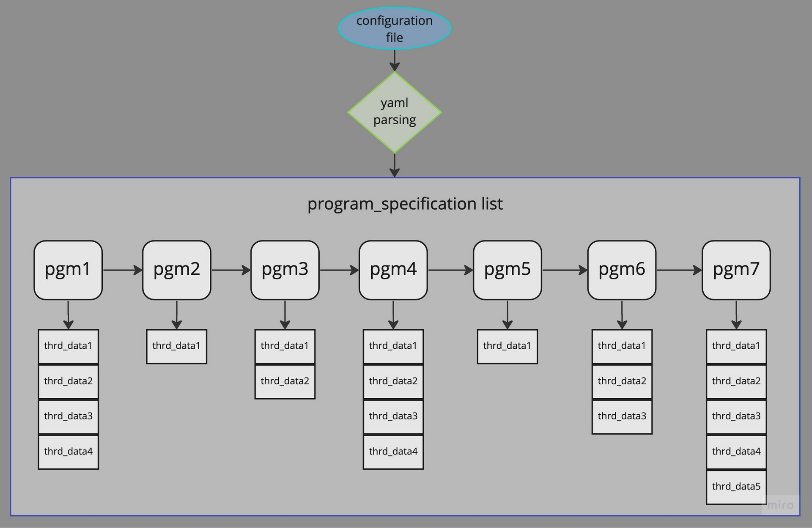
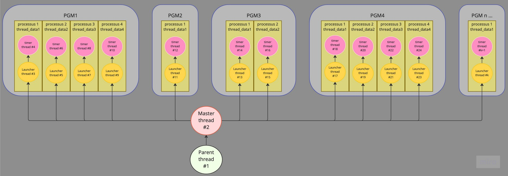
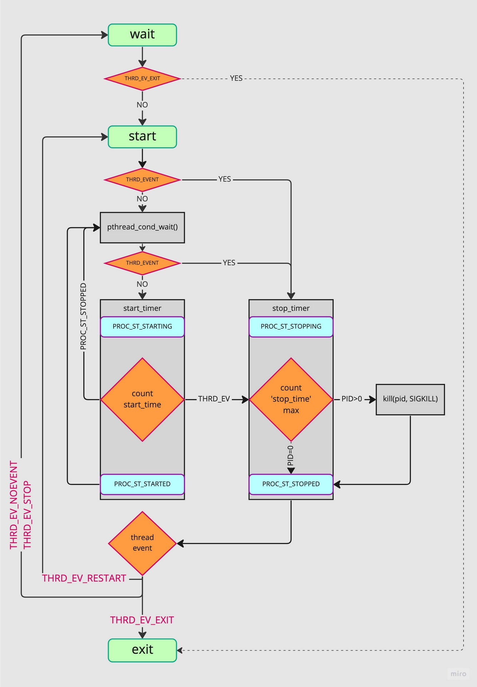
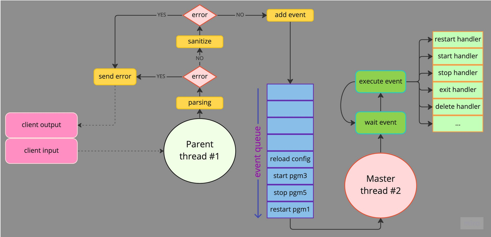

# taskmaster

**taskmaster** is a job supervisor, a little bit like supervisor, written in C.

- configuration file in yaml format.
- provide a lightweight CLI with history and auto-completion
- see the status of programs & processus
- stop, start, or restart a program
- activity logging
- others features detailed in configuration file.

This is a school project. This version is a **proof of concept** for the personal purpose of mastering multi-threading. This led me to use some features from the pthread library like _read/write locks_, _barriers_, _conditional locks_, _semaphores_... and to deepen some MT problems like read-write or producer-consumer problems. Some diagrams are available in the 'under the hood' section.
The yaml parsing is made with the help of the [libyaml](https://github.com/yaml/libyaml).
I coded my own lighweight line editor to avoid the use of heavy _readline_ and just learn. This [line editor](https://github.com/antirez/linenoise) was my inspiration.

## build & usage

**clang** is needed to build taskmaster

```bash
$ git clone https://github.com/Jibus22/taskmaster.git && cd taskmaster
$ make prod
```

Here is a simple example of how to use taskmaster

```bash
$ ./taskmaster -f inexistentconfigfile.yaml
./taskmaster: inexistentconfigfile.yaml: No such file or directory
$ ./taskmaster
Usage: ./taskmaster [-f filename]
$ ./taskmaster -f configfile.yaml
taskmaster$ help
start <name>		Start processes
stop <name>		Stop processes
restart <name>		Restart all processes
status <name>		Get status for <name> processes
status		Get status for all programs
exit		Exit the taskmaster shell and server.
taskmaster$ status
daemon_EPSILON - run <0/1>
daemon_DELTA - run <1/1>
daemon_BETA - run <5/5>
daemon_ALPHA - run <2/2>
taskmaster$ status daemon_ALPHA daemon_EPSILON
- daemon_ALPHA:
pid <23701> - state <started>
pid <23700> - state <started>
- daemon_EPSILON:
pid <23696> - state <started>
taskmaster$ status uhsf ksf
./taskmaster: command error: bad argument
taskmaster$ tiud
./taskmaster: command error: command not found
taskmaster$ stop daemon_ALPHA
taskmaster$ status
daemon_EPSILON - run <1/1>
daemon_DELTA - run <1/1>
daemon_BETA - run <5/5>
daemon_ALPHA - run <0/2>
taskmaster$ start daemon_ALPHA
taskmaster$ status daemon_ALPHA
- daemon_ALPHA:
pid <23704> - state <started>
pid <23703> - state <started>
taskmaster$
```

## Logging

**taskmaster** logs into _./taskmaster.log_. There is no way to modify it elsewhere than in the source define in _src/main.c_ for now. It should be an option in the config file.
Here is an example of a log:

```
2023-01-04, 22:53:40 - [taskmaster] - program started
2023-01-04, 22:53:40 - [start] - daemon_EPSILON
2023-01-04, 22:53:40 - [start] - daemon_DELTA
2023-01-04, 22:53:40 - [start] - daemon_BETA
2023-01-04, 22:53:40 - [start] - daemon_ALPHA
2023-01-04, 22:53:40 - [  launcher thread] - [daemon_BETA pid[23693]] - tid[139748303697664] - restart_counter[2] • [LAUNCHED]
2023-01-04, 22:53:40 - [  launcher thread] - [daemon_BETA pid[23695]] - tid[139748286912256] - restart_counter[2] • [LAUNCHED]
2023-01-04, 22:53:40 - [  launcher thread] - [daemon_EPSILON pid[23696]] - tid[139748545902336] - restart_counter[2] • [LAUNCHED]
2023-01-04, 22:53:40 - [  launcher thread] - [daemon_BETA pid[23697]] - tid[139748026869504] - restart_counter[2] • [LAUNCHED]
2023-01-04, 22:53:40 - [  launcher thread] - [daemon_DELTA pid[23698]] - tid[139748529116928] - restart_counter[2] • [LAUNCHED]
2023-01-04, 22:53:40 - [  launcher thread] - [daemon_BETA pid[23699]] - tid[139748253341440] - restart_counter[2] • [LAUNCHED]
2023-01-04, 22:53:40 - [  launcher thread] - [daemon_BETA pid[23694]] - tid[139748270126848] - restart_counter[2] • [LAUNCHED]
2023-01-04, 22:53:40 - [  launcher thread] - [daemon_ALPHA pid[23700]] - tid[139748010084096] - restart_counter[3] • [LAUNCHED]
2023-01-04, 22:53:40 - [  launcher thread] - [daemon_ALPHA pid[23701]] - tid[139747993298688] - restart_counter[3] • [LAUNCHED]
2023-01-04, 22:53:41 - [      start timer] - [daemon_BETA pid[23694]] - tid[139748270126848] - rank[2] - start_time[1000 ms] • [STARTED CORRECTLY]
2023-01-04, 22:53:41 - [      start timer] - [daemon_BETA pid[23693]] - tid[139748303697664] - rank[0] - start_time[1000 ms] • [STARTED CORRECTLY]
2023-01-04, 22:53:41 - [      start timer] - [daemon_BETA pid[23697]] - tid[139748026869504] - rank[4] - start_time[1000 ms] • [STARTED CORRECTLY]
2023-01-04, 22:53:41 - [      start timer] - [daemon_BETA pid[23695]] - tid[139748286912256] - rank[1] - start_time[1000 ms] • [STARTED CORRECTLY]
2023-01-04, 22:53:41 - [      start timer] - [daemon_BETA pid[23699]] - tid[139748253341440] - rank[3] - start_time[1000 ms] • [STARTED CORRECTLY]
2023-01-04, 22:53:42 - [      start timer] - [daemon_ALPHA pid[23701]] - tid[139747993298688] - rank[1] - start_time[2000 ms] • [STARTED CORRECTLY]
2023-01-04, 22:53:42 - [      start timer] - [daemon_ALPHA pid[23700]] - tid[139748010084096] - rank[0] - start_time[2000 ms] • [STARTED CORRECTLY]
2023-01-04, 22:53:42 - [      start timer] - [daemon_DELTA pid[23698]] - tid[139748529116928] - rank[0] - start_time[2000 ms] • [STARTED CORRECTLY]
2023-01-04, 22:53:48 - [      start timer] - [daemon_EPSILON pid[23696]] - tid[139748545902336] - rank[0] - start_time[8000 ms] • [STARTED CORRECTLY]
2023-01-04, 22:54:12 - [stop] - daemon_ALPHA
2023-01-04, 22:54:17 - [ child supervisor] - [daemon_ALPHA pid[23701]] - tid[139747993298688] - restart_counter[0] • [KILLED BY SIGNAL 9]
2023-01-04, 22:54:17 - [ child supervisor] - [daemon_ALPHA pid[23700]] - tid[139748010084096] - restart_counter[0] • [KILLED BY SIGNAL 9]
2023-01-04, 22:54:17 - [       stop timer] - [daemon_ALPHA] - tid[139747993298688] - rank[1] - stop_time[5000 ms] • [PROCESSUS HAD BEEN KILLED]
2023-01-04, 22:54:17 - [       stop timer] - [daemon_ALPHA] - tid[139748010084096] - rank[0] - stop_time[5000 ms] • [PROCESSUS HAD BEEN KILLED]
```

## Configuration file

Here is an example of a configuration file with comments:

```yaml
programs:
  daemon_ONE: # Name you give to the program. This is added in the auto-completion list of the CLI
    cmd: "/home/user/daemon1 arg1 arg2" # The command to use to launch the program
    numprocs: 2 # The number of processes to start and keep running
    umask: 777 # umask of the program (default: inherited from taskmaster)
    workingdir: /tmp # Working directory of the program (default: current)
    autostart: true # Whether to start this program at launch or not
    autorestart: unexpected # Whether the program should be restarted always, never, or on unexpected exits only
    exitcodes: # Which return codes represent an "expected" exit status (default: 0)
      - 0
      - 2
    startretries: 3 # How many times a restart should be attempted before aborting
    starttime: 2 # How long the program should be running after it’s started for it to be considered "successfully started" in seconds
    stopsignal: SIGTERM # Which signal should be used to stop (i.e. exit gracefully) the program
    stoptime: 5 # How long to wait after a graceful stop before killing the program, in seconds
    stdout: /tmp/alpha.stdout # Options to redirect the program’s stdout/stderr to files (default: /dev/null)
    stderr: /tmp/alpha.stderr
    env: # Environment variables given to the program
      STARTED_BY: taskmaster
      ANSWER: 42
  daemon_TWO:
    cmd: "/home/user/daemon2 arg1 arg2"
    numprocs: 5
    umask: 077
    workingdir: /home/user42
    autostart: true
    autorestart: true
    exitcodes: 0
    startretries: 2
    starttime: 1
    stopsignal: SIGUSR1
    stoptime: 3
    stdout: /tmp/beta.stdout
    stderr: /tmp/beta.stderr
```

### error handling & sanitation

Here is an example of error handling and sanitation of config file:

```bash
$ ./taskmaster -f test/config/config_5.yaml
Parse error: stopsignal key: wrong value
Line: 14 Column: 17
$ ./taskmaster -f test/config/config_5.yaml
Parse error: stoptime key: wrong value
Line: 15 Column: 15
$ ./taskmaster -f test/config/config_5.yaml
Sanitize error: daemon_ALPHA - cmd key: No such file or directory
Sanitize error: daemon_ALPHA - stdout key: No such file or directory
2 errors detected
$
```

## Under the hood

### data structure

More info on pgm in _include/taskmaster.h_


### multi-threading structure

Each arrow represents the dependency between threads. Which creates which. They are all joinable. A launcher thread launch and waits for a processus and restarts it if specified in client config. There is one launcher thread per processus and each of them launch a closely related timer thread which measure the starting and the stopping of the processus.
At the end, depending on the size of the configuration, we can reach a big amount of threads. Again, this version is a _poc_.


### launcher-thread workflow

The launcher thread pool is created at the start of **taskmaster**. A launcher thread has 2 states: idle & started. However its runtime obeys to 4 event states: no_event, event_stop, event_restart and event_exit.


### timer-thread workflow

The timer thread is created by its launcher thread. It is closely synchronized with it, with the help of tools like _mutexes_, _pthread_barriers_, _conditional locks_ and _semaphores_. It has 3 states: idle, waiting (for a restart) and started. Its runtime obeys to the same event states as the launcher thread.


### producer-consumer workflow

This multi-threaded version of **taskmaster** has a producer-consumer design. It is a well-known, proven, efficient and reliable design which works around an event queue, filled by a thread (here, client request from command line input) and consumed by another one.


